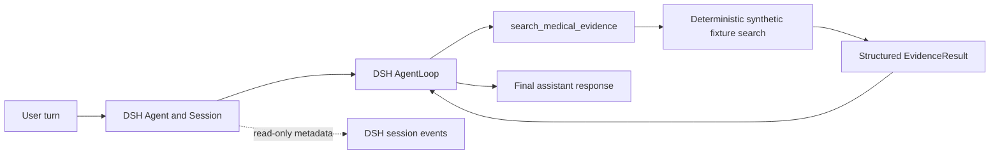

# Huiyi MedHarness — F0

F0 is a small, out-of-tree DSH bundle that registers one native tool, `search_medical_evidence`. It searches only the synthetic fixture in `fixtures/evidence.json`; it does not connect to hospital data or a vector store, or implement its own model runtime or clinical workflow. The opt-in F0.1 smoke uses the model configured by DSH.

## Runtime boundary



DSH owns the agent, session, loop, dispatch, result admission, cancellation, and event stream. This package owns the tool contract, fixture data and search, and domain tests. There is one runtime: DSH.

## Tool contract

Input: `{ "query": string, "topK"?: integer }`.

- `query` must contain non-whitespace text; the trimmed value is used.
- `topK` defaults to `3` and must be an integer from `1` through `10`.
- Search uses deterministic keyword matching and a stable evidence-ID tie-breaker.
- Canonical output is `{ "query": string, "hits": EvidenceHit[] }`. A hit contains `evidenceId`, `rank`, `title`, `snippet`, `source`, `sourceType`, and `score`.
- Every fixture source is `fixture://<evidenceId>`. Fixture content is fabricated for software verification and is not medical advice.
- The session observer reports event type and correlation metadata only; it omits user prompts, assistant text, tool arguments, tool content, and evidence snippets.

## Local development

Use Node.js `^22.19.0 || >=24.0.0` and pnpm `11.7.0`, matching the pinned DSH source.

```powershell
pnpm install
pnpm typecheck
pnpm test
pnpm build
```

The tests are offline: they use only synthetic fixtures and do not require an API key, model, GPU, hospital data, or Python. `pnpm build` emits the plugin entry point under `lib/` for the DSH loader.

## Install into a local DSH profile

With DSH `5badb15009ae1756c3afe0ae0cef1faafc290ccc` available as a local CLI/runtime, install the already-built local checkout:

```powershell
dsh plugin --profile huiyi-dev add --workspace-root D:\MyLab\harness\huiyi\Huiyi-MedHarness
dsh --profile huiyi-dev --dump-config
dsh --profile huiyi-dev
```

The config dump should include the `huiyi-medharness-evidence` row. The pinned DSH CLI's published guide shows the bare `add <package>` form, but in this environment pnpm 11 treats the initialized profile as a workspace root and rejects it unless `--workspace-root` is passed through. The extra flag is forwarded to pnpm by `dsh plugin`.

For a GitHub install, the `prepare` script builds the TypeScript entry point. If pnpm blocks that build, allow this package in the profile's `pnpm-workspace.yaml` and retry:

```yaml
allowBuilds:
  huiyi-medharness: true
```

## Local Qwen smoke test

This smoke uses the real DSH `agent-loop` and its native `ctx.tools` dispatch path. It keeps the existing synthetic fixture as the only evidence source. It does not call production RAG or add another agent runtime.

1. Start an OpenAI-compatible Chat Completions server for the local model at `~/gpufree-share/data/Qwen3-8B` if one is not already running. For example, from an environment that already provides vLLM:

   ```bash
   MODEL_DIR="$HOME/gpufree-share/data/Qwen3-8B"
   MODEL_ID=Qwen/Qwen3-8B
   vllm serve "$MODEL_DIR" \
     --served-model-name "$MODEL_ID" \
     --host 127.0.0.1 --port 8000 \
     --max-model-len 32768 \
     --enable-auto-tool-choice --tool-call-parser hermes
   ```

   The endpoint protocol, model id, URL, and context window are deployment values. Keep them in the profile patch, not in `src/index.ts`. The verified deployment used served id `Qwen/Qwen3-8B` and context window 32768; the model config allows up to 40960.

2. Use the DSH CLI release matching pinned commit `5badb15009ae1756c3afe0ae0cef1faafc290ccc` (`0.2.1-alpha.1`; check `dsh --version`). Install the Huiyi bundle into the built-in headless profile, then merge [`examples/local-qwen-profile.patch.example.yml`](examples/local-qwen-profile.patch.example.yml) into `$DSH_HOME/profiles/headless/cordis.patch.yml` (the patch replaces each targeted row's whole `config`):

   ```bash
   npm install -g @deepseek-ai/dsh@0.2.1-alpha.1
   dsh plugin --profile headless add --workspace-root "$PWD"
   ```

   The example uses DSH's `@deepseek-ai/dsh-llm-pi-ai` with `api: openai-completions`, and selects its `local-qwen` route through `agent-default-model`.

3. pi-ai's OpenAI-compatible route requires a key or an `Authorization` header even when a local endpoint is keyless. Supply a non-secret placeholder via the configured `apiKeyEnv` reference; a server that does not enforce authentication can ignore the bearer value:

   ```bash
   export HUIYI_LOCAL_QWEN_API_KEY=local-placeholder
   export HUIYI_SESSION_TRACE_FILE="$PWD/artifacts/f0.1/session-trace.jsonl"
   ```

4. Send the three prompts below through the built-in `headless` profile. It runs one turn per invocation; pass the `sessionId` from the first JSON `session` event with `--session-id` on the next two invocations so all turns adopt the same persisted DSH Session. Pipe prompts on stdin and consume the JSON stream transiently; the Huiyi observer writes only filtered metadata to `HUIYI_SESSION_TRACE_FILE`.

   - Tool required: `请调用 search_medical_evidence 搜索“血压测量记录”，并只根据返回的合成证据作简短总结。`
   - No tool: `不要调用任何工具，只回答 2 + 2 的结果。`
   - Empty hit: `请调用 search_medical_evidence 搜索“量子星云临床试验”，并说明是否有匹配记录。`

   Confirm all records have the same `sessionId`; `turn/start` and `turn/end` cover all three turns with `reasonKind: "completed"`; turns 1 and 3 have a native `tool/call` and successful `tool/result`; turn 2 has no tool call. The trace records the resolved provider/model/context and the evidence `hitCount` only, so turn 1 should have a positive count and turn 3 should have `hitCount: 0`. Prompts, assistant text, tool arguments, and evidence content are omitted. Use a fresh trace path for each run so the saved file describes one session.

The F0.1 live run is recorded in [`artifacts/f0.1-local-qwen-live-20261007/run-metadata.json`](artifacts/f0.1-local-qwen-live-20261007/run-metadata.json) and its metadata-only session trace is next to it. For future runs, save DSH commit, Huiyi commit, local model id, endpoint protocol, each turn outcome, and total tool-call count next to the JSONL trace. Calculate wall latency in milliseconds from the first `turn/start.time` to the last `turn/end.time`. Do not copy terminal conversation text into the trace artifact.

## HC-MEM-001 long-term memory integration

AMA is integrated as a Python memory service behind the single DSH runtime. Automatic recall contributes one cached, turn-scoped `<patient_memory>` context through DSH's prompt assembly waterfall. Only a successfully settled root turn is captured. Patient history is labeled as contextual history, separate from medical evidence. See [the memory boundary ADR](docs/adr/0002-ama-memory-boundary.md), [the lifecycle](docs/memory/lifecycle.md), and [health-engine setup](services/health-engine/README.md).

The development health-engine uses the existing Python 3.12 uv environment with FAISS because the Health-Copilot training environment does not include `faiss-cpu`; the shared Health-Copilot environment remains available for local vLLM and was left unchanged. Set `HUIYI_MEMORY_USER_ID` only for a single-user local profile. A multi-user host should call exported `applyWithIdentity(ctx, resolver)` and resolve identity from authenticated host session metadata.

## HC-RAG-001 medical evidence service

`search_medical_evidence` calls the shared local `health-engine` RAG route. It returns a provenance-bearing `EvidenceSet` from the already-prepared MedCPT MedText sample. In `iterative` mode, a local Qwen planner generates a bounded number of structured search queries; the Python subsystem stops after evidence acquisition and never writes the user-facing answer. DSH's same AgentLoop consumes the tool result and produces the final answer. Patient `MemorySnapshot` and external `EvidenceSet` remain separate domains.

The accepted reproduction was a small local smoke, not a MedQA accuracy run: 60 Textbooks chunks plus 33 chunks from one StatPearls article, MedCPT, Qwen3-8B, `n_rounds=1`, `n_queries=2`, and `k=3`. Its exact metadata-only trace and limitations are mapped in [the upstream audit](docs/rag/imedrag-upstream-map.md). Reusable retrieval/evaluation practices reviewed from Health-Copilot are recorded in [the engineering lessons note](docs/rag/health-copilot-engineering-lessons.md). Corpus and FAISS assets remain outside Git; the manifest records hashes, counts, model revisions, and the fact that the original dataset Git revisions were not captured.

### Start the local RAG data plane

Use the existing FAISS-capable Python environment documented above. Copy the deployment sample to an ignored local file and source it:

```bash
cp examples/local-rag.env.example .env.rag
set -a
source .env.rag
set +a
export PYTHONPATH="$PWD/services/health-engine/src"
ENGINE_PYTHON=/root/gpufree-data/AMA/.venv/bin/python
"$ENGINE_PYTHON" -m uvicorn huiyi_health_engine.app:app --host 127.0.0.1 --port 8322 --no-access-log
```

The RAG app validates the local corpus/index manifest and MedCPT revision at startup. Missing or mismatched assets fail startup; no request downloads, clones, or builds a corpus. `scripts/rag/verify_index.py --corpus-root "$HUIYI_RAG_CORPUS_ROOT" --manifest "$HUIYI_RAG_MANIFEST_PATH"` verifies the prepared assets. `scripts/rag/build_index.py` is an explicit offline rebuild using the configured local MedCPT Article Encoder. If the sample health-engine port is already occupied, choose another loopback port and set both `HUIYI_HEALTH_ENGINE_PORT` and `HUIYI_HEALTH_ENGINE_URL` to match; keep the existing shared process untouched.

### Local Qwen live smoke

1. Use the already-running vLLM OpenAI-compatible Qwen service if it is still available. The deployment sample points to `127.0.0.1:8001`; check the endpoint/model before use. The outer DSH route and health-engine planner may share it. Use the configured non-secret placeholder if the endpoint is keyless.
2. Start the health-engine with `examples/local-rag.env.example`, then check `GET /v1/rag/status` reports `ready`.
3. Install this bundle in the pinned DSH profile and merge [`examples/local-qwen-rag-profile.patch.example.yml`](examples/local-qwen-rag-profile.patch.example.yml). Keep one DSH Session ID for the acceptance turns. Exercise a tool-required medical query with `mode=iterative`, a simple no-tool turn, a `mode=single` query, and an intentionally unsupported topic to check weak-result handling. A dense index can return nearest neighbors for an unsupported query; verify DSH explicitly treats unrelated results as insufficient and does not cite them. Preserve the native DSH `tool/call` → `tool/result` → next model step → `turn/end` trace. The saved observer trace includes metadata only, not prompts, answers, snippets, or generated query text.
4. Run the DSH + local-Qwen live acceptance; unit tests and direct HTTP/tool calls are not a substitute for the real AgentLoop turn.

Live metrics, the local corpus manifest, limitations, frozen [acceptance prompts](artifacts/hc-rag-001/evaluation-cases.json), and the complete metadata-only DSH session trace belong under [`artifacts/hc-rag-001/`](artifacts/hc-rag-001/). They are separate from the earlier reproduction outcome. The synthetic fixture remains in `fixtures/evidence.json` for offline domain tests; live `search_medical_evidence` uses the prepared external corpus.

## Repository map

- `src/index.ts` — DSH plugin entry and native tool definition.
- `src/evidence.ts` — input validation and deterministic fixture search.
- `src/trace.ts` — read-only, metadata-only DSH session-event observer.
- `fixtures/evidence.json` — fabricated evidence records.
- `tests/evidence.test.ts` — offline contract and event-observation tests.
- `docs/adr/0001-dsh-runtime-boundary.md` — pinned-source research and ownership decision.

F0 established the native DSH tool boundary using deterministic synthetic evidence. HC-MEM-001 and HC-RAG-001 add separate capabilities behind the shared health-engine without changing DSH's ownership of the user turn. There is still no second AgentLoop, multi-agent orchestration, hosted OpenAI API dependency, or hospital-record integration.
