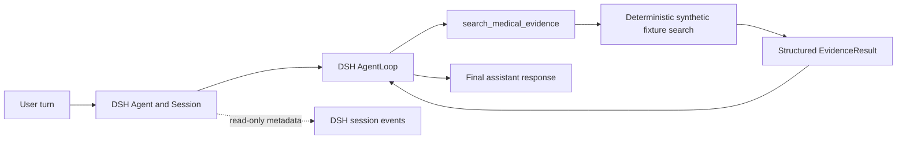

# Huiyi MedHarness — F0

F0 is a small, out-of-tree DSH bundle that registers one native tool, `search_medical_evidence`. It searches only the synthetic fixture in `fixtures/evidence.json`; it does not connect to hospital data, a vector store, an LLM, or a clinical workflow.

## Runtime boundary



DSH owns the agent, session, loop, dispatch, result admission, cancellation, and event stream. This package owns the tool contract, fixture data and search, and domain tests. There is one runtime: DSH.

## Tool contract

Input: `{ "query": string, "topK"?: integer }`.

- `query` must contain non-whitespace text; the trimmed value is used.
- `topK` defaults to `3` and must be an integer from `1` through `10`.
- Search uses deterministic keyword matching and a stable evidence-ID tie-breaker.
- Canonical output is `{ "query": string, "hits": EvidenceHit[] }`. A hit contains `evidenceId`, `rank`, `title`, `snippet`, `source`, `sourceType`, and `score`.
- Every fixture source is `fixture://<evidenceId>`. Fixture content is fabricated for software verification and is not medical advice.
- The session observer reports event type and correlation metadata only; it omits user prompts, assistant text, tool arguments, tool content, and evidence snippets.

## Local development

Use Node.js `^22.19.0 || >=24.0.0` and pnpm `11.7.0`, matching the pinned DSH source.

```powershell
pnpm install
pnpm typecheck
pnpm test
pnpm build
```

The tests are offline: they use only synthetic fixtures and do not require an API key, model, GPU, hospital data, or Python. `pnpm build` emits the plugin entry point under `lib/` for the DSH loader.

## Install into a local DSH profile

With DSH `5badb15009ae1756c3afe0ae0cef1faafc290ccc` available as a local CLI/runtime, install the already-built local checkout:

```powershell
dsh plugin --profile huiyi-dev add --workspace-root D:\MyLab\harness\huiyi\Huiyi-MedHarness
dsh --profile huiyi-dev --dump-config
dsh --profile huiyi-dev
```

The config dump should include the `huiyi-medharness-evidence` row. The pinned DSH CLI's published guide shows the bare `add <package>` form, but in this environment pnpm 11 treats the initialized profile as a workspace root and rejects it unless `--workspace-root` is passed through. The extra flag is forwarded to pnpm by `dsh plugin`.

For a GitHub install, the `prepare` script builds the TypeScript entry point. If pnpm blocks that build, allow this package in the profile's `pnpm-workspace.yaml` and retry:

```yaml
allowBuilds:
  huiyi-medharness: true
```

For the live smoke, send a prompt that asks the agent to call `search_medical_evidence` and return the matching synthetic evidence. A live turn requires a configured model provider; the bundle build, typecheck, and tests do not.

## Repository map

- `src/index.ts` — DSH plugin entry and native tool definition.
- `src/evidence.ts` — input validation and deterministic fixture search.
- `src/trace.ts` — read-only, metadata-only DSH session-event observer.
- `fixtures/evidence.json` — fabricated evidence records.
- `tests/evidence.test.ts` — offline contract and event-observation tests.
- `docs/adr/0001-dsh-runtime-boundary.md` — pinned-source research and ownership decision.

This is the F0 implementation only. It deliberately has no Python runtime, HTTP service, RAG pipeline, memory, or multi-agent behavior.
