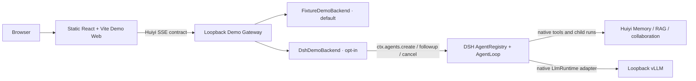

# Local Demo Workstation architecture

## Runtime boundaries

- The web app owns browser chat state, selected synthetic case, visible drawers, and rendering.
- The Gateway owns HTTP/SSE transport, a bounded mapping from browser session keys to DSH `AgentHandle` capabilities, cancellation transport, backend selection, and metadata-only logs. The mapping holds handles only; DSH `Session` owns the transcript.
- DSH owns each actual Agent, Session, AgentLoop, tool dispatch, result admission, cooperative cancellation, and Session events. The web adapter creates a root with `ctx.agents.create()`, submits turns with `agent.followup()`, observes `agent/assistant-stream` and `session/event`, and disposes the returned handle. It creates no second AgentLoop.
- `DshWebRuntime` composes pinned DSH `0.2.1-alpha.1` in process: Cordis, AgentRegistry, SessionStore, AgentLoop, native ToolRuntime, SubagentRuntime, `spawn` provider, and pi-ai local-model adapter.
- Huiyi's existing `applyWithIdentity()` installs a read-only Memory lifecycle by default, the local RAG tool, and typed clinical collaboration. For a local synthetic-only longitudinal test, `HUIYI_DEMO_SYNTHETIC_AMA_MEMORY=1` enables AMA recall/commit under a stable patient-scoped pseudonymous ID; the flag is rejected in production. In that mode, collaboration receives the same turn-scoped AMA snapshot and retrieved external evidence as separate typed fields. It never reads or writes real patient memory.
- The fixture backend remains deterministic and is still the default. It simulates UI activity and synthetic evidence; it is not an agent runtime.

## Session and cancellation lifecycle

The Gateway maps `(browser session ID, synthetic patient ID)` to one native DSH root handle. A new browser Session or selected patient gets a fresh root. Later turns reuse that Agent's DSH Session. At most 16 root handles are retained by default; idle least-recently-used handles are disposed when capacity is needed. This is process-local demo state: Gateway restart clears it.

The caller's `AbortSignal` reaches the native DSH `agent.cancel({ kind: 'user' })` seam. Cancelling a run waits for the Agent to become idle; shutdown disposes every handle and then the Cordis fiber. Specialist children are created by Huiyi's existing `ctx.subagents` runner with fresh `spawn` context, bounded product policy, and `maxDepth: 1`.

## Assistant UI and SSE

Use `useLocalRuntime + ChatModelAdapter` to own browser chat state and run lifecycle. The adapter POSTs the latest user message to `/api/chat`, parses the Huiyi v1 SSE contract, and yields cumulative text snapshots. It passes the runtime `AbortSignal` to `fetch` and requests Gateway cancellation once the response run ID is known. The web client never contacts model, DSH, or Health Engine ports.

The Gateway maps only DSH text-delta frames to `assistant.delta`; reasoning, tool arguments, prompts, child outputs, and raw DSH events stay server-side. RAG evidence and collaboration events are reduced to validated, bounded display metadata. A turn is successful only when DSH records `turn/end` with reason `completed` and at least one visible text delta.

The browser API is unauthenticated and this adapter binds to loopback only. It is a local synthetic demo, not a hospital deployment endpoint.

## Evidence and memory

Patient context is fetched from synthetic fixtures and marked fictional. Its memory snapshot remains distinct from `externalEvidence`. The live backend can invoke Huiyi's `search_medical_evidence` and `consult_clinical_team` DSH tools. Only retrieved source passages are shown in the Evidence drawer. The Gateway never writes prompts, assistant output, memory text, evidence snippets, tool arguments, credentials, or provider payloads to logs.

## Local processes and backend selection

The Vite dev server binds to `127.0.0.1:5173` and proxies `/api/*` to the Gateway at `127.0.0.1:8320`. The Gateway binds to loopback. `HUIYI_DEMO_BACKEND` defaults to `fixture`; set it to `dsh` to use the native DSH composition. `HUIYI_DEMO_MODEL_BACKEND` defaults to `vllm`, using `http://127.0.0.1:8000/v1` and model `Qwen/Qwen3-8B`; `deepseek-api` selects DeepSeek's hosted API and defaults to `deepseek-flash`, with optional model override `HUIYI_DEMO_DEEPSEEK_MODEL`. The DeepSeek endpoint is fixed to `https://api.deepseek.com`, and its key is read from `DEEPSEEK_API_KEY`. Both modes use the configured context window (default 40,960). Model and corpus files remain outside Git.

`pnpm demo:build` emits a static frontend and a compiled Node Gateway containing the Huiyi integration code. The demo package pins its DSH runtime dependencies instead of relying on a host-global `dsh` CLI or writable home profile.
