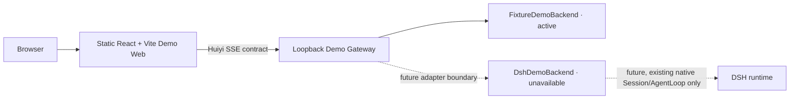

# Local Demo Workstation architecture

## Runtime boundaries

- The web app owns browser UI state: assistant-ui messages, selected synthetic case, visible drawers, and rendering.
- The Gateway owns the HTTP/SSE boundary, ephemeral run-to-session mapping, cancellation transport, backend selection, and metadata-only logs.
- DSH remains the sole owner of an actual Agent, Session, AgentLoop, tool dispatch, admission, native cancellation, and durable session events. The DSH adapter in this phase is an explicit unavailable stub.
- The fixture backend simulates UI activity and deterministic synthetic evidence. It is not an agent runtime and does not claim to execute real RAG, memory, or specialist collaboration.

## assistant-ui choice

Use the current documented `useLocalRuntime + ChatModelAdapter` API. `LocalRuntime` owns only chat message state and its run lifecycle; the adapter POSTs the latest user message to `/api/chat`, parses Huiyi SSE events, and yields cumulative text snapshots. It passes the runtime `AbortSignal` to `fetch` and requests the Gateway cancellation endpoint once the response run ID is known. The web client does not contact model, DSH, or Health Engine ports.

The Gateway protocol is Huiyi-owned and deliberately independent of DSH event names or internal payloads. The future DSH backend seam must map to an existing DSH host Session/AgentLoop and native cancellation lifecycle. It must not add a session store, AgentLoop, tool runtime, hidden reasoning output, or a second state machine. When the browser aborts the SSE response, it separately awaits the cancellation endpoint's terminal acknowledgement so the activity pane can still show the cancellation event.

## Evidence and memory

Patient context is fetched from synthetic fixtures. Its longitudinal memory summary remains in a distinct UI card. Evidence items travel as typed fixture events and open in a separate source drawer. Gateway log records contain IDs, event names, backend, duration, status, and safe error codes only. Neither prompts, answers, memory content, evidence snippets, nor credentials are written to logs or artifacts.

## Local processes

The Vite dev server binds only to `127.0.0.1:5173` and proxies `/api/*` to the Gateway on `127.0.0.1:8320`. The Gateway binds only to loopback. `pnpm demo:build` emits a static frontend bundle and a separately compiled Node Gateway. The production frontend needs no SSR server.

## Backend selection

`HUIYI_DEMO_BACKEND` defaults to `fixture`. Selecting `dsh` returns the safe `BACKEND_UNAVAILABLE` event because a real Web host integration has not been accepted or implemented. The documented local path and all acceptance tests use fixture mode and CPU only.
