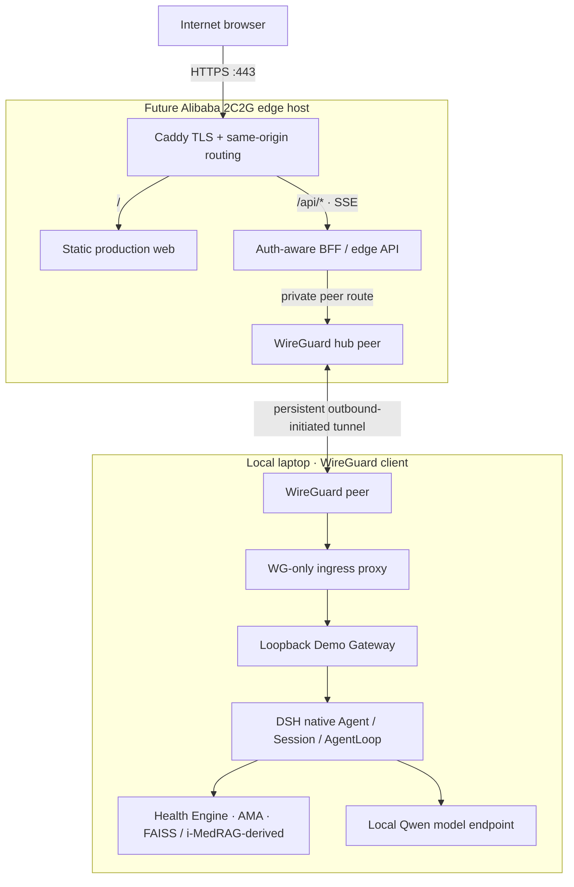

# Future Edge migration specification

This document is a plan only. No cloud instance, DNS name, tunnel, proxy, TLS certificate, or public listener is configured by this task.



The laptop initiates and maintains the WireGuard tunnel to the public edge host, so it can sit behind ordinary NAT. The VPS is the public portal and tunnel hub; the model, patient memory, vector index, source corpora, DSH runtime, and Health Engine stay on the laptop. This diagram is a target design, not a deployed or security-reviewed configuration.

## What belongs on the 2 vCPU / 2 GiB server

- Caddy (or equivalent) for TLS, static production assets, same-origin routing, SSE streaming, and security headers.
- A small authentication-aware BFF/API that verifies the institutional OIDC login, enforces user/role/session policy, applies request limits, and forwards only authorized requests over WireGuard.
- WireGuard hub interface and peer configuration; firewall exposes HTTPS publicly and the chosen WireGuard UDP port, while internal application ports remain private.
- Static frontend bundle, non-secret public runtime configuration, deployment version, and minimal health/status metadata.
- Optional short-lived session/cache data only if the identity/session design requires it; no patient memory, patient database, clinical conversation archive, evidence corpus, model weights, Milvus/FAISS index, or inference runtime.

Keep OIDC client secrets, WireGuard private keys, session signing secrets, and TLS private keys outside the Git checkout with restrictive filesystem permissions. The edge API must not log request bodies or SSE content. No clinician credential or patient context belongs in browser local storage.

## Routing and streaming

- Serve the Vite production bundle as static files at `/` from the edge host.
- Route `/api/*` to the Edge Gateway, then over a private WireGuard route to the local Gateway. The browser must never target DSH, Health Engine, model, vector-store, or internal tool ports.
- Terminate the public portal's OIDC flow at the edge BFF (or a reviewed identity proxy). Forward a short-lived, signed identity assertion over the authenticated WireGuard peer; the laptop Gateway must validate its issuer, audience, expiry, signature, and bound subject. Never trust browser-supplied `X-User`, role, tenant, patient, or session headers.
- Preserve SSE as an unbuffered response: Caddy `flush_interval -1` (or the currently supported equivalent), `text/event-stream`, no response buffering/compression that delays chunks, and long-enough idle/read timeouts. Exercise event arrival and cancellation through the real proxy before relying on it.

  A future Caddyfile shape (review against the deployed Caddy release before use):

  ```caddyfile
  demo.example.invalid {
      encode zstd gzip
      handle /api/* {
          reverse_proxy 127.0.0.1:8321 {
              flush_interval -1
          }
      }
      handle {
          root * /srv/huiyi-demo
          try_files {path} /index.html
          file_server
      }
  }
  ```

  The loopback upstream is the edge BFF on port 8321. It forwards only through the private WireGuard peer route.
- The laptop keeps DSH, Gateway, model, AMA and Health Engine bound to loopback. Add a small laptop-side ingress proxy that listens only on the laptop's WireGuard address and forwards to `127.0.0.1:8320`; permit traffic only from the VPS peer address. Do not make the current loopback-only Health Engine or model endpoint directly reachable over WireGuard.
- The WireGuard tunnel is laptop-initiated and persistent. Restrict peer `AllowedIPs` to the single laptop ingress address/port path. Use a keepalive appropriate for NAT, rotate keys, and define recovery behavior when the laptop sleeps or loses connectivity.

## Identity, patient access, and memory isolation

Login is required before any real-patient workflow is exposed. Network encryption and WireGuard peer identity protect the transport; they do not identify the clinician or authorize a patient record.

- Authenticate clinicians through the institution's OIDC identity provider. Require institution-managed accounts and MFA where available; assign server-verified clinician/admin roles.
- The patient picker is populated from an authorized server-side patient/Encounter API. It shows only records allowed to the authenticated subject. The browser submits an opaque patient/Encounter reference, but the laptop Gateway rechecks authorization on every context, chat, cancel, trace, and memory request; a supplied ID is never proof of access.
- Bind each DSH Session to the authenticated subject, organization/tenant, authorized patient, Encounter, and session lifetime. A different patient or Encounter starts a separate DSH Session.
- Resolve AMA's stable memory namespace server-side from the authorized patient identity and tenant; do not accept an arbitrary client `userId`. Recall and commit use that namespace, and access checks happen before either operation. A clinician's access to one patient must not grant access to another patient's memory.
- Add negative integration tests for cross-patient memory recall, cross-tenant patient references, unauthorized roles, session replay, multiple users on one patient, concurrent patients, cancellation, and stale/revoked sessions. Audit denied access with metadata only; never log names, raw context, memory text, or evidence passages.
- Until a trusted identity provider, authorization-aware patient/Encounter adapter, and these isolation checks exist, production chat remains fail-closed. The current synthetic local demo is not an authenticated clinical endpoint.

## Security and operations placeholders

Before any Internet-facing demo, define and test:

- TLS and certificate renewal; HTTPS-only redirects and security headers.
- OIDC authentication and session handling; CSRF protection for cookie-authenticated actions. A no-login synthetic preview may be separately isolated and must not expose real patient data or persistent AMA memory.
- Explicit CORS policy (same-origin preferred), rate limiting, request body limits, input validation, per-user and global concurrency limits.
- Connect/read/run timeouts; SSE proxy and disconnect handling; cooperative native DSH cancellation.
- Health/readiness checks that expose no prompts, patient details, credentials, or internal addresses.
- Structured audit metadata with request/run/session IDs, timing, backend, result code; never record prompt, answer, patient memory, evidence snippet, or token.
- Firewall: public ingress only to HTTPS on the edge; WireGuard only from the named peer; compute/model/internal service ports remain private.
- Backup, updates, incident response, and retention policies appropriate to any later authenticated test cohort.

Keep the 2C2G host to static serving, a small auth-aware BFF, Caddy, and WireGuard. Model inference, retrieval, memory, source data, and DSH remain on the laptop. Validate memory pressure and concurrency in a separately authorized deployment task; confirm stable laptop power/sleep settings and network uptime before treating this as an always-on clinical service.
