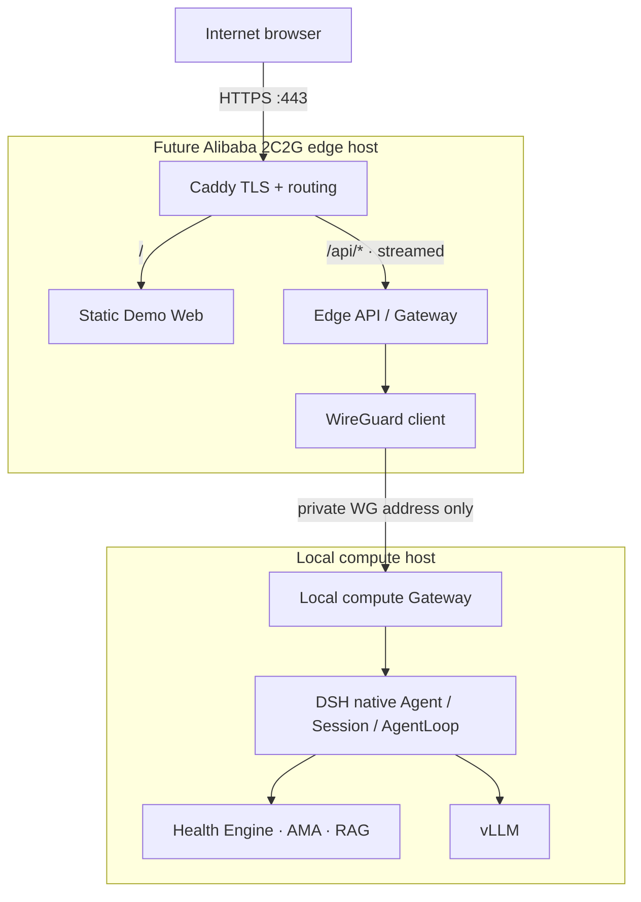

# Future Edge migration specification

This document is a plan only. No cloud instance, DNS name, tunnel, proxy, TLS certificate, or public listener is configured by this task.



## Routing and streaming

- Serve the Vite production bundle as static files at `/` from the edge host.
- Route `/api/*` to the Edge Gateway, then over a private WireGuard route to the local Gateway. The browser must never target DSH, Health Engine, model, vector-store, or internal tool ports.
- Preserve SSE as an unbuffered response: Caddy `flush_interval -1` (or the currently supported equivalent), `text/event-stream`, no response buffering/compression that delays chunks, and long-enough idle/read timeouts. Exercise event arrival and cancellation through the real proxy before relying on it.

  A future Caddyfile shape (review against the deployed Caddy release before use):

  ```caddyfile
  demo.example.invalid {
      encode zstd gzip
      handle /api/* {
          reverse_proxy 127.0.0.1:8320 {
              flush_interval -1
          }
      }
      handle {
          root * /srv/huiyi-demo
          try_files {path} /index.html
          file_server
      }
  }
  ```

  The loopback upstream above stands for the edge-side API. Its tunnel upstream and firewall target must be the private WireGuard address when the edge-to-compute hop is added.
- Keep the local Gateway bound to the WireGuard interface/private address or loopback plus a narrowly scoped firewall rule. Permit the edge host's WireGuard peer only; never bind DSH, vLLM, Milvus, AMA, or Health Engine APIs to a public interface.

## Security and operations placeholders

Before any Internet-facing demo, define and test:

- TLS and certificate renewal; HTTPS-only redirects and security headers.
- Demo authentication and session handling; CSRF protection for cookie-authenticated actions.
- Explicit CORS policy (same-origin preferred), rate limiting, request body limits, input validation, per-user and global concurrency limits.
- Connect/read/run timeouts; SSE proxy and disconnect handling; cooperative native DSH cancellation.
- Health/readiness checks that expose no prompts, patient details, credentials, or internal addresses.
- Structured audit metadata with request/run/session IDs, timing, backend, result code; never record prompt, answer, patient memory, evidence snippet, or token.
- Firewall: public ingress only to HTTPS on the edge; WireGuard only from the named peer; compute/model/internal service ports remain private.
- Backup, updates, incident response, and retention policies appropriate to any later authenticated test cohort.

Keep the 2C2G host to static serving, a small edge API, Caddy, and WireGuard. Model inference, retrieval, memory, and DSH remain on the compute host. Validate memory pressure and concurrency in a separately authorized deployment task.
